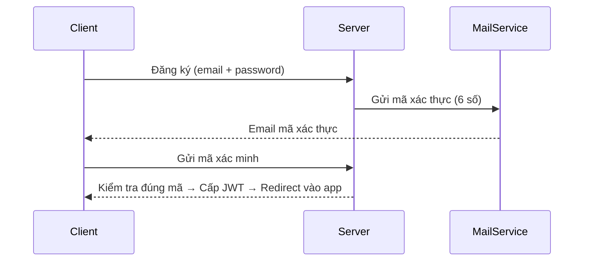

# 📘 Proposal: WeConnect System Architecture

## 1. 🎯 Mục tiêu dự án

WeConnect là một mạng xã hội đơn giản hướng đến trải nghiệm giao tiếp thời gian thực. Dự án cho phép người dùng kết nối, trò chuyện (text, ảnh, file, emoji, voice), gửi yêu cầu kết bạn, quản lý thông báo, và trong tương lai sẽ mở rộng thêm tính năng đăng bài như Facebook.

---

## 2. 🧩 Danh sách chức năng chính

* Đăng ký/Đăng nhập bằng email (có xác thực qua mã 6 số)
* Cấp JWT tự động sau khi xác thực thành công
* Gửi/Lưu tin nhắn (text, hình, emoji, voice, file)
* Chat nhóm (Group Chat)
* Gửi & xử lý yêu cầu kết bạn (FriendRequest)
* Chặn người dùng
* Quản lý thông báo
* (Tương lai) Đăng bài, tương tác bài viết (like, comment)

---

## 3. 📌 Sơ đồ Use Case (Mermaid)

```mermaid
%% Diagram đầy đủ các hành vi của người dùng đã đăng nhập
%% Actor chính: Người dùng đã đăng nhập

  usecaseDiagram
  actor User as "Người dùng đã đăng nhập"

  User --> (Đăng xuất)
  User --> (Nhắn tin văn bản)
  User --> (Gửi ảnh)
  User --> (Gửi file)
  User --> (Gửi emoji)
  User --> (Gửi voice message)
  User --> (Nhận thông báo)
  User --> (Gửi yêu cầu kết bạn)
  User --> (Chấp nhận / Từ chối lời mời)
  User --> (Chặn người khác)
  User --> (Tham gia nhóm chat)
  User --> (Rời nhóm)
  User --> (Xem hồ sơ người khác)
  User --> (Chỉnh sửa hồ sơ cá nhân)
```

---

## 4. 🏗 Kiến trúc hệ thống tổng quát

* Frontend (SPA): React + TypeScript + TailwindCSS + React Router + Axios + WebSocket
* Backend: Java Spring Boot + JPA + JWT + WebSocket (STOMP) + SendGrid
* Database: MySQL
* (Optional) Redis để lưu cache JWT hoặc track người dùng online
* Kiến trúc phân tầng: Controller → Service → Repository

---

## 5. 🧱 Sơ đồ cơ sở dữ liệu (ERD tóm tắt)

(Bản đầy đủ bạn đã vẽ, ở đây là mô tả logic)

**Tables chính:**

* `users`, `user_sessions`
* `friend_requests`, `blocks`
* `messages`, `media`
* `groups`, `group_members`
* `notifications`

---

## 6. 🔄 Luồng xử lý chính: Đăng ký → Xác minh → Cấp JWT



---

## 7. 📁 Cấu trúc thư mục Frontend

```
src/
├── api/                    # API layer
│   ├── axios.ts           # Axios instance & interceptors
│   ├── endpoints.ts       # API endpoints
│   └── services/          # API services by feature
├── app/                   # App-wide configs & providers
│   ├── providers/         # Context providers
│   ├── store/            # State management 
│   └── routes/           # Route definitions
├── features/             # Feature based modules
│   ├── auth/            # Authentication feature
│   │   ├── components/  # Auth UI components
│   │   │   ├── LoginForm.tsx
│   │   │   └── RegisterForm.tsx
│   │   ├── hooks/      # Auth custom hooks
│   │   ├── services/   # Auth services
│   │   └── types/      # Auth types
│   ├── chat/           # Chat feature
│   │   ├── components/
│   │   ├── hooks/
│   │   └── services/
│   ├── friends/        # Friends management
│   │   ├── components/
│   │   └── services/
│   └── notifications/  # Notifications
│       ├── components/
│       └── services/
├── shared/             # Shared resources
│   ├── components/     # Reusable components
│   │   ├── ui/        # UI components
│   │   └── layout/    # Layout components
│   ├── hooks/         # Custom hooks
│   ├── types/         # Common types
│   └── utils/         # Utility functions
└── assets/            # Static assets
```

---

## 8. 🚀 Định hướng phát triển tương lai

* Tính năng **bài đăng**:

  * Tạo bài viết (text, ảnh, video)
  * Thả cảm xúc, bình luận
  * Hiển thị trang cá nhân như Facebook
* Tích hợp voice/video call (sau)
* Tối ưu performance với Redis, WebSocket Cluster
* Responsive UI cho mobile

---

✍️ *Tài liệu này mô tả kiến trúc hệ thống ban đầu để nộp báo cáo và hỗ trợ nhóm phát triển. Có thể được điều chỉnh thêm tùy theo tiến độ phát triển.*
